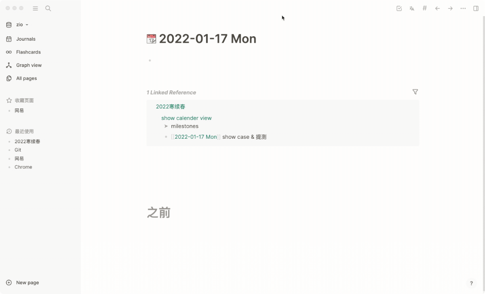

# logseq-plugin-milestone
> 在日历中显示时间节点

简体中文 | [English](./README.md)
- ## 示例 




- ## 使用方法
  1. 安装插件
  2. 填写插件配置, **必须填写 `dateFormatter`**
  3. 输入 `/` 命令, 选择 `milestone` \ `milestones-page` \ `milestones-all`
  4. milestone:在 milestones 的子节点中输入时间节点
  5. milestones-page:拉取页面在各个journal中的信息作为里程碑
  6. milestones-all:综合4和5
- ## 插件配置
- dateFormatter: 参考 [moment](https://momentjs.com/docs/#/displaying/) 填写时间格式化字符串, 必须匹配您笔记里的时间格式
- ## 配置示例
  ```json
  {
  "dateFormatter": "YYYY-MM-DD ddd"
  }